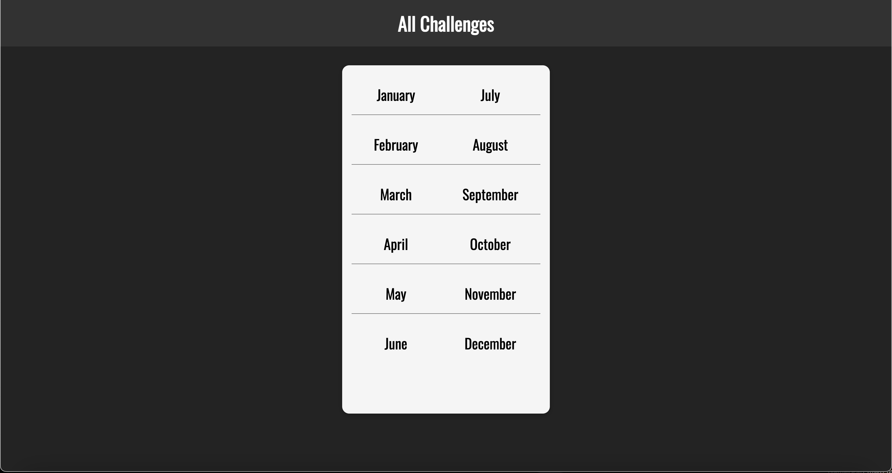
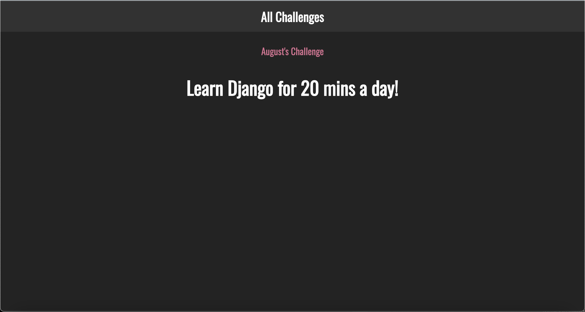

# Monthly Challenges is a mini-project I built with Python and Django.
Being my first Django project, it is quite simple. 
It features two pages: 
## A read all page with a list of all 12 months. 

## Each month is a link to a detail page that displays a challenge for the month.

